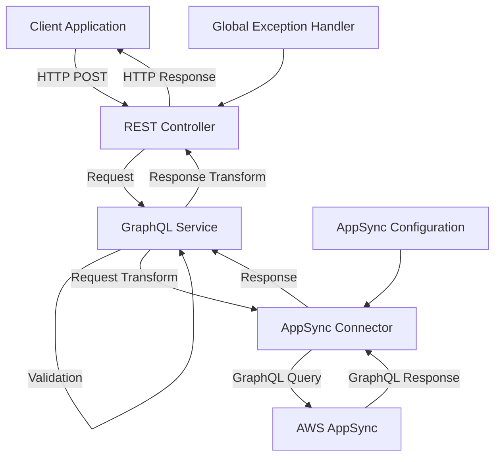

# System Architecture

## Overview
The Spring Boot AppSync Integration service follows a clean architecture approach with clear separation of concerns. The application acts as a middleware layer between client applications and AWS AppSync GraphQL services.

## System Components

## Architectural Layers

### 1. API Layer (Controller)
- **AppSyncController**: REST controller that exposes a POST endpoint at `/api/graphql`
- Receives GraphQL request DTOs from clients
- Delegates processing to the service layer
- Returns standardized API responses

### 2. Service Layer
- **GraphQLService**: Interface defining the contract for GraphQL operations
- **AppSyncService**: Implementation of GraphQLService that:
  - Validates incoming requests
  - Transforms DTOs to internal models
  - Calls the connector layer
  - Handles errors with domain-specific exceptions

### 3. Connector Layer
- **AppSyncConnector**: Feign client interface for AWS AppSync
- Handles HTTP communication with the AppSync endpoint
- Adds necessary authentication headers
- Manages timeouts and retries

### 4. Model/DTO Layer
- **GraphQLRequestDto**: External-facing DTO for client requests
- **GraphQLRequest**: Internal model for connector requests
- **ApiResponse**: Standardized response wrapper for all API responses

### 5. Exception Handling
- **DomainCode**: Enum of domain-specific error codes with message templates
- **DomainException**: Custom exception with domain context
- **GlobalExceptionHandler**: Central exception handler for all errors
- Translates exceptions to appropriate HTTP status codes

### 6. Configuration
- **AppSyncConfig**: Configuration for Feign client and AppSync connection
- **JacksonConfig**: JSON serialization/deserialization configuration

## Request Flow
1. Client sends a POST request to `/api/graphql` with a GraphQL query
2. AppSyncController receives the request and calls the GraphQLService
3. AppSyncService validates the request and transforms it to a GraphQLRequest
4. AppSyncConnector sends the request to AWS AppSync with proper authentication
5. Response is received and transformed back through the service layer
6. Controller returns a standardized ApiResponse to the client

## Error Handling Flow
1. Exceptions thrown at any layer are propagated up
2. GlobalExceptionHandler catches all exceptions
3. Exceptions are mapped to appropriate HTTP status codes
4. Standardized error responses are returned to clients

## Configuration
- AWS AppSync endpoint and API key configuration via application.yml
- Timeout and retry configuration for Feign client
- Logging configuration for troubleshooting 